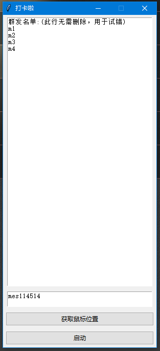

# SMForQQ

## 简介

一款开源的“暴力”催打卡消息群发助手，仅用于QQ消息（或者操作符合代码逻辑的其他聊天软件），欢迎其他人员改进和扩展。

## 环境

Windows 10 （其他Windows版本无测试，不确定是否能用）

## 目录

| 软件目录           |                    |
| ------------------ | ------------------ |
| --pycache--        | Python本体环境     |
| build              | Python库和运行环境 |
| dist               | .exe 可执行文件    |
| img                | 教程内图片         |
| READMEtoSMForQQ.md | 教程               |
| SMForQQ.py         | 源码               |
| SMForQQ.spec       | 软件信息           |

## 使用

1. 双击 ./SMForQQ/dist/SMForQQ.exe 启动。

2. 输入“群发名单”，格式为一行一个名字，按回车换行。

3. 输入“群发内容”，格式为一行到底，自动换行。

	

4. 单击“获取鼠标位置”按钮，按提示进行即可。


5. 单击“启动”，按提示操作。

## 问题

1. 使用期间不可使用鼠标键盘，弹窗会导致执行错误。
2. 每台电脑性能不一样，但作者设置的sleep参数是一样的。

## 源码

### sleep参数修改

你可能会觉得运行的很慢，这时候你就可以修改适合自己电脑的sleep参数提高效率。

```python
    for i in lst:
        m.click(mouseSearchXY[0], mouseSearchXY[1])
        time.sleep(3)  # 按自己电脑性能修改数字，1=1s
        pyperclip.copy(i)
        k.press_key(k.control_key)
        k.tap_key('v')
        k.release_key(k.control_key)
        time.sleep(3)  # 按自己电脑性能修改数字，1=1s
        k.tap_key(k.enter_key)
        time.sleep(3)  # 按自己电脑性能修改数字，1=1s
        m.click(mouseInputXY[0], mouseInputXY[1])
        time.sleep(3)  # 按自己电脑性能修改数字，1=1s
        pyperclip.copy(msgContent)
        k.press_key(k.control_key)
        k.tap_key('v')
        k.release_key(k.control_key)
        time.sleep(3)  # 按自己电脑性能修改数字，1=1s
        k.tap_key(k.enter_key)
        time.sleep(3)  # 按自己电脑性能修改数字，1=1s
```

### Python库环境

修改sleep参数后无法使用原可执行程序启动你修改后的程序，须有Python环境，在编译器启动。

```python
# 安装本程序需要的库
pip install pypiwin32
pip install pyUserInput==0.1.10
pip install pyperclip
```

### 打包

如果你觉得每次在编译器启动很麻烦，也可双击.py源码启动，或者打包成.exe。

打包前删除除“img”、“READMEtoSMForQQ.md”、“SMForQQ.py”之外的文件。

```python
# 安装打包命令的库
pip install pyinstaller==4.4
# 执行打包命令
pyinstaller -F -w SMForQQ.py
```